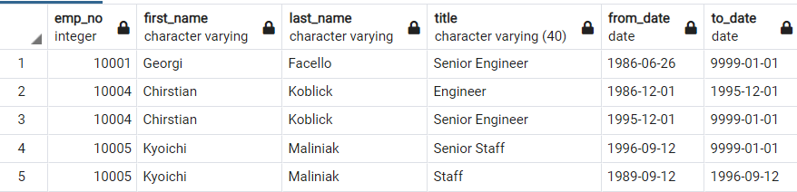
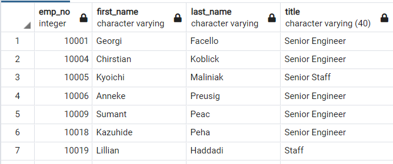
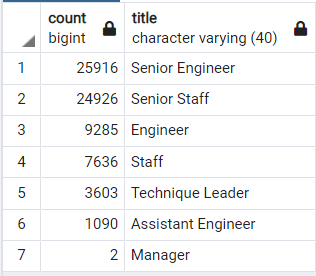

# Pewlett-Hackard-Analysis

## Project Overview

Perform an analysis to determine the number of retiring employees per title and identify employees who are eligible to participate in a mentorship program.

Analysis key deliverables:

1. The Number of Retiring Employees by Title
2. The Employees Eligible for the Mentorship Program
3. A written report on the employee database analysis

This project was fully developed in SQL using PostgreAQL, code can be checked at the following link:

[Employee_Database_challenge.sql](Analysis Projects/Pewlett-Hackard-Analysis/Queries/Employee_Database_challenge.sql)

## Results

* The [retirement_titles.csv](Analysis Projects/Pewlett-Hackard-Analysis/Data/retirement_titles.csv) query gave us a perspective on how many employees were to retire soon, but as it have duplicated employees the info was not accurate.

* To exclude the duplicated employees the [unique_titles.csv](Analysis Projects/Pewlett-Hackard-Analysis/Data/unique_titles.csv) query was done.

* To understand how the soon to be retired employees will affect the different departaments, the query [retiring_titles.csv](Analysis Projects/Pewlett-Hackard-Analysis/Data/retiring_titles.csv) was done.

* Finally, to have a better perspective on how many employees would be eligible for the Mentorship Program the query [mentorship_eligibilty.csv](Analysis Projects/Pewlett-Hackard-Analysis/Data/mentorship_eligibilty.csv) was done.

## Summary

* The Pewlett Hackard has 72,458 to retire in the short-term, and only 1,549 that are eligible to the Mentorship Program, and potentially would be ready to cover the desks left by the retired employees. The company needs to be ready to massively hire new employees in the coming years.
